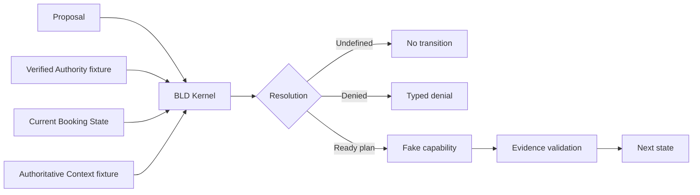
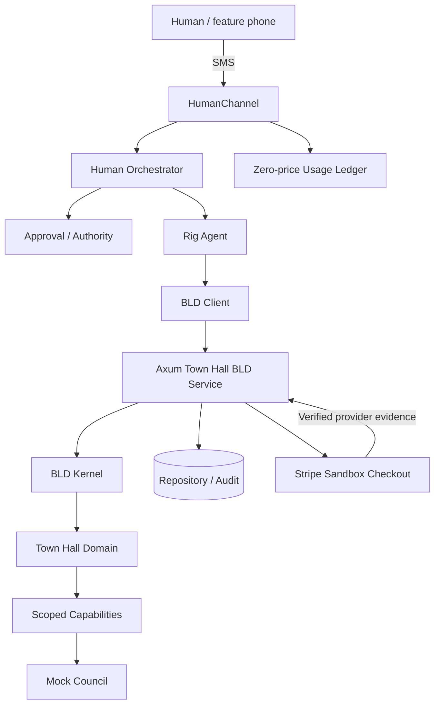

# Architecture

## Current executable slice (M0–M2)

The initial repository stops here on purpose. No HTTP, database, SMS provider, payment provider, or model is necessary to prove M1/M2 semantics.

## Target vertical slice

## Trust rule

The proposer can select **which declared behaviour to propose**, but it cannot:

- mutate booking state;
- create transition edges;
- choose authoritative fee/provider parameters;
- mint authority;
- declare external evidence valid;
- commit state.
