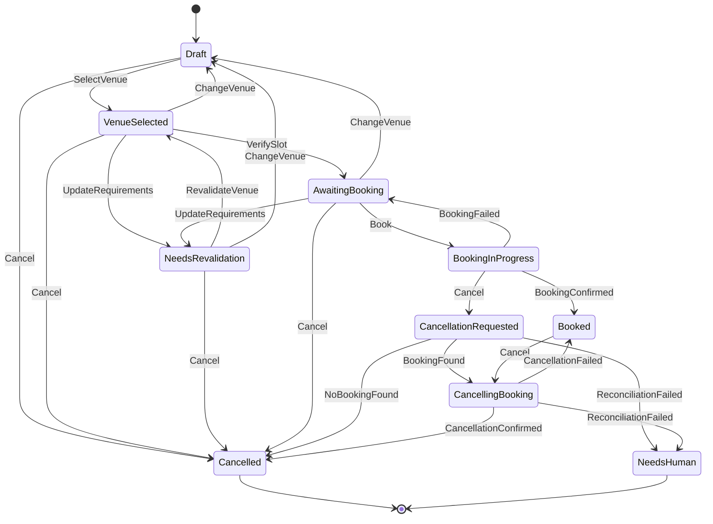

# Town Hall State Machine

The initial state vocabulary follows the technical specification.

## State-scoped behaviour rule

Concrete state types own only behaviours that exist in that state. For example `Draft` can select a venue or cancel, but cannot book. Runtime enum dispatch maps an absent state/proposal pairing to `Resolution::Undefined`.
