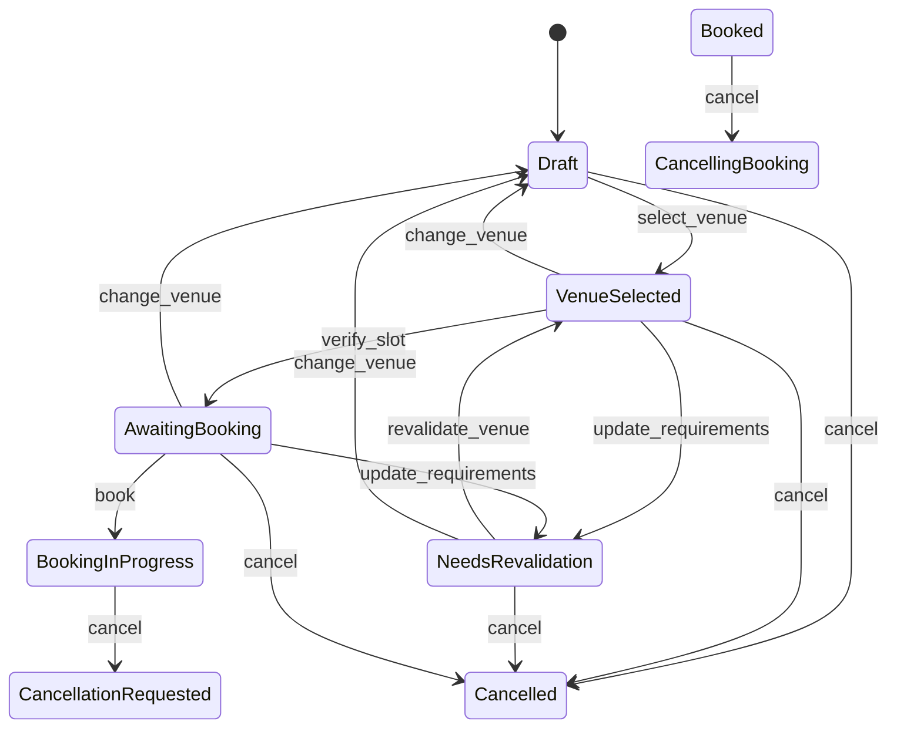
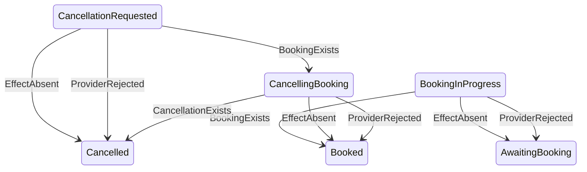

# Town Hall State Machine

State vocabulary follows the technical specification. **Edge provenance follows ADR-012** —
transitions are grouped by which door drives them, because that is the security boundary,
not a presentational choice.

> Canonical type definitions live in [`decisions.md`](decisions.md) (ADR-012). This document
> shows the graph; it deliberately does not restate field lists, so the two cannot drift.

## Intent edges — a human or agent may request these

Reachable through `BookingProposal` via `resolve_proposal`.

Note `book` now targets `BookingInProgress`, not `Booked`: the effect intent is committed
before the council is called (ADR-014).

## Observation edges — only verified provider facts may drive these

Reachable only through `VerifiedProviderFact` via `resolve_fact`. **No proposer can submit
these.** The fact is state-neutral; the label below is the domain's *interpretation* of it
in that state.

One `EffectAbsent` fact, three meanings — derived from the persisted intent and the current
state, never from the fact itself:

### Completeness

Every in-flight state must have an edge for every authoritative outcome its active intent
can produce, or recovery can stick. Checked exhaustively rather than case by case:

| In-flight state | active intent | `BookingExists` | `CancellationExists` | `EffectAbsent` | `ProviderRejected` |
|---|---|---|---|---|---|
| `BookingInProgress` | booking | `Booked` | n/a¹ | `AwaitingBooking` | `AwaitingBooking` |
| `CancellationRequested` | booking | `CancellingBooking` | n/a¹ | `Cancelled` | `Cancelled` |
| `CancellingBooking` | cancellation | n/a¹ | `Cancelled` | `Booked` | `Booked` |

¹ Not applicable because the fact's **kind** does not match the active intent's kind — a
booking outcome arriving while a cancellation intent is active, or the reverse.

Note this is *not* caught by identity binding: an effect id does not encode its kind, so a
wrong-kind fact can carry the very id in `active_effect` and pass that check. The binding must
compare kinds explicitly and refuse with `Denied(EffectKindMismatch)`. A refusal with a
reason, not a silent gap.

### The three meanings of absence

| At | The absent intent was | Means | Goes to |
|---|---|---|---|
| `BookingInProgress` | a booking | the booking never happened | `AwaitingBooking` |
| `CancellationRequested` | a booking | there is nothing to cancel | `Cancelled` |
| `CancellingBooking` | a cancellation | the cancellation never happened | `Booked` |

The first is the commonest recovery path, not a corner case: the create request never
arrived, its deadline passed, and the council tombstoned the intent. The third is its exact
mirror on the cancellation side. Each finalises the old intent and clears `active_effect`,
and any re-proposal mints a **fresh** intent — a tombstoned one can never succeed, so reusing
it would guarantee an effect that never happens.

The same `BookingExists` fact means *booking confirmed* at `BookingInProgress` and *booking
found* at `CancellationRequested`. That is what lets a fact which lost a compare-and-set be
re-evaluated against the new state rather than discarded.

> Every `EffectAbsent` edge above is gated on **ADR-016**: absence is admissible only from
> the council's definitive-absence response, which durably tombstones the intent. Before
> that, a "not found" is `Unknown` and drives nothing — the council may still act on an
> in-flight request.

### The executable classification

The fact door implements the matrix through a three-way category, decided by the state
alone before any guard runs or any context is read:

| Category | States | Meaning |
|---|---|---|
| **Waiting** | `BookingInProgress`, `CancellationRequested`, `CancellingBooking` | an effect is in flight; a fact may answer it |
| **Settled** | `AwaitingBooking`, `Booked`, `Cancelled` | a fact-driven edge lands here; an arriving fact must already be reflected |
| **Absent** | `Draft`, `VenueSelected`, `NeedsRevalidation`, `NeedsHuman` | neither in flight nor fact-reachable; `Undefined` immediately |

`Absent` returning before anything is consulted is what preserves the `Undefined`/`Denied`
distinction on this door: irrelevant context must not manufacture behaviour in a state that
has none. The Settled category is what keeps ADR-016's race closed — a `BookingExists`
arriving after its intent was tombstoned lands in a Settled state and is refused loudly,
never silently dropped. `Converged` requires the state, the persisted canonical plan and
the intent's durable outcome to agree; where the fact carries no reference to compare
(`EffectAbsent`, `ProviderRejected`), the state is compared against the plan instead.

The full 40-cell matrix (10 states × 4 facts) is pinned by the `fact_topology` test module
in `crates/townhall-domain`; `LOCKED_FACTS` there is the executable form of this section,
and a diff to it needs an ADR.

## System-event edges — deterministic runtime facts

Reachable only through `SystemEvent` via `resolve_system_event`. Neither intent nor
external fact: the council cannot tell us our own retry budget is exhausted.

Per ADR-019 this door **moves no state**. `ReconciliationExhausted` at an in-flight state records
a pursuit decision against the effect — we stop chasing at retry cadence, flag it for a human,
and keep asking slowly — and the booking stays exactly where it is, because the council may well
hold the effect and any other state would assert what nobody established. A late authoritative
fact then lands through the ordinary fact-door arms above, whose per-state meanings are the
information a state change would have destroyed.

`NeedsHuman` is currently unreachable: it awaits the milestone that gives a human something to
do (M6 at the earliest), and per ADR-019 §7 it is deleted rather than promoted if human actions
turn out to attach to any in-flight state rather than only to given-up ones.

## Terminal states

`Cancelled` has no outbound edges through any door.

## State-scoped behaviour rule

Concrete state types own only the behaviours that exist in that state — `Draft` can select a
venue or cancel, but has no `book`. An absent `(state, proposal)` pairing resolves to
`Resolution::Undefined`, which is distinct from `Denied`: the first means the behaviour does
not exist here at all, the second that it exists but a guard refused it.

The same trichotomy applies to the fact door, which adds a fourth outcome, `Converged`, for
a fact that local state already reflects. See ADR-012.

The full 70-cell intent topology (10 states x 7 proposals, once `Reconcile` is removed) is pinned by the `topology` test module in
`crates/townhall-domain`; `LOCKED` there is the executable form of the intent graph above.
