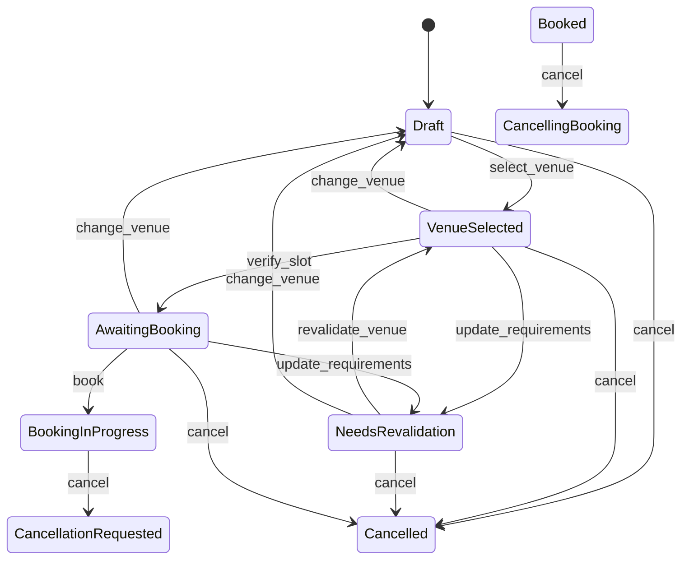
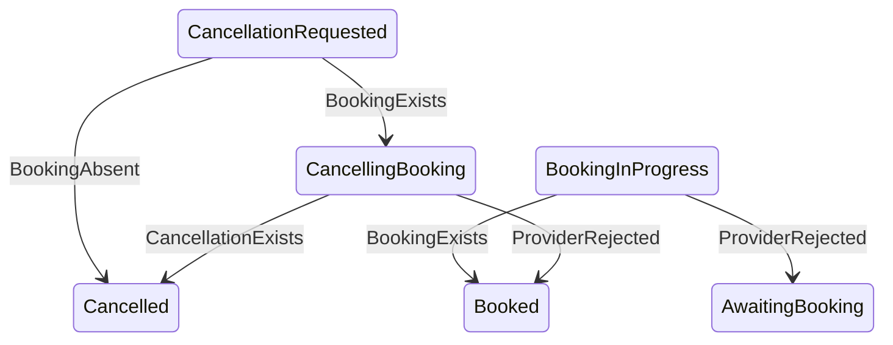
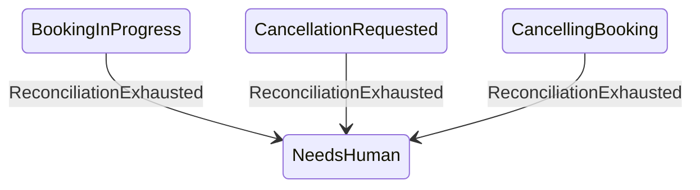

# Town Hall State Machine

State vocabulary follows the technical specification. **Edge provenance follows ADR-012** —
transitions are grouped by which door drives them, because that is the security boundary,
not a presentational choice.

> Canonical type definitions live in [`decisions.md`](decisions.md) (ADR-012). This document
> shows the graph; it deliberately does not restate field lists, so the two cannot drift.

## Intent edges — a human or agent may request these

Reachable through `BookingProposal` via `resolve_proposal`.

Note `book` now targets `BookingInProgress`, not `Booked`: the effect intent is committed
before the council is called (ADR-014).

## Observation edges — only verified provider facts may drive these

Reachable only through `VerifiedProviderFact` via `resolve_fact`. **No proposer can submit
these.** The fact is state-neutral; the label below is the domain's *interpretation* of it
in that state.

The same `BookingExists` fact means *booking confirmed* at `BookingInProgress` and *booking
found* at `CancellationRequested`. That is what lets a fact which lost a compare-and-set be
re-evaluated against the new state rather than discarded.

> ⚠ `CancellationRequested --BookingAbsent--> Cancelled` is **blocked pending an
> architectural decision**. Absence is not stable over time: a stale `BookingAbsent`
> verified before the provider finished creating the booking would commit a terminal
> `Cancelled` while the room is actually booked. See the negative-fact section of
> [`m4-effects-guidance.md`](m4-effects-guidance.md).

## System-event edges — deterministic runtime facts

Reachable only through `SystemEvent` via `resolve_system_event`. Neither intent nor
external fact: the council cannot tell us our own retry budget is exhausted.

`NeedsHuman` is reachable only this way, which is why M4 builds this door rather than
deferring it.

## Terminal states

`Cancelled` and `NeedsHuman` have no outbound edges through any door.

## State-scoped behaviour rule

Concrete state types own only the behaviours that exist in that state — `Draft` can select a
venue or cancel, but has no `book`. An absent `(state, proposal)` pairing resolves to
`Resolution::Undefined`, which is distinct from `Denied`: the first means the behaviour does
not exist here at all, the second that it exists but a guard refused it.

The same trichotomy applies to the fact door, which adds a fourth outcome, `Converged`, for
a fact that local state already reflects. See ADR-012.

The full 70-cell intent topology (10 states x 7 proposals, once `Reconcile` is removed) is pinned by the `topology` test module in
`crates/townhall-domain`; `LOCKED` there is the executable form of the intent graph above.
