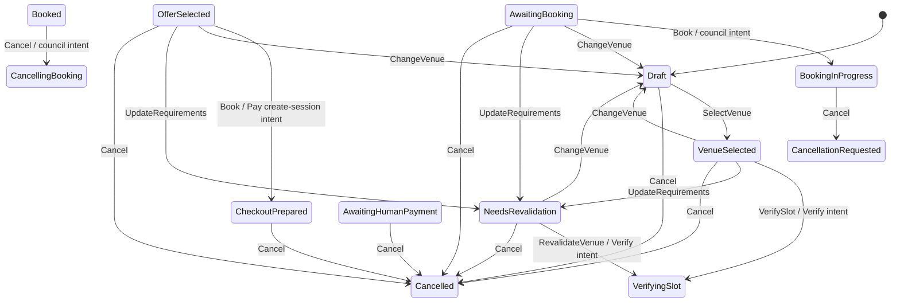
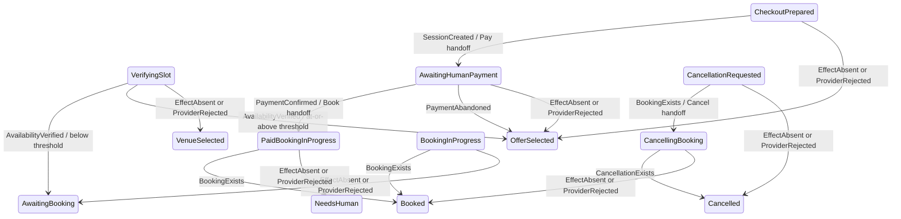

# Town Hall State Machine

State vocabulary follows the technical specification and ADR-030. **Edge provenance follows
ADR-012**: transitions are grouped by the door that drives them, because that is the security
boundary rather than a presentational choice.

The exhaustive, generated `state × input` tables are in [`topology.md`](topology.md). They are
produced by running the real domain, so this file concentrates on the protocol rather than
duplicating all 128 fact cells.

## Intent edges — a human or agent may request these

`VerifySlot`, `RevalidateVenue`, both booking paths, and cancellation all commit an in-flight
state and durable intent before any provider call.

## Observation edges — only verified provider facts may drive these

The payment confirmation edge atomically records the verified `PaymentConfirmed` outcome and
starts the paid council-booking intent. `PaidBookingInProgress` is deliberately distinct from
the unpaid booking state: a council rejection after money is banked must reach `NeedsHuman`,
never return to a state that could charge again. `PaymentConfirmed` remains part of the closed
state vocabulary for the verified settlement snapshot; the atomic handoff's durable waiting
state is `PaidBookingInProgress`.

## Completeness

Every waiting state covers every authoritative outcome its active intent can produce:

| Waiting state | Intent | Positive fact | Positive target | Negative target |
|---|---|---|---|---|
| `VerifyingSlot` | Verify | `AvailabilityVerified` | `AwaitingBooking` or `OfferSelected` | `VenueSelected` |
| `CheckoutPrepared` | Pay (create) | `SessionCreated` | `AwaitingHumanPayment` | `OfferSelected` |
| `AwaitingHumanPayment` | Pay (await) | `PaymentConfirmed` | `PaidBookingInProgress` | `OfferSelected` |
| `BookingInProgress` | Book | `BookingExists` | `Booked` | `AwaitingBooking` |
| `PaidBookingInProgress` | Book | `BookingExists` | `Booked` | `NeedsHuman` |
| `CancellationRequested` | Book | `BookingExists` | `CancellingBooking` | `Cancelled` |
| `CancellingBooking` | Cancel | `CancellationExists` | `Cancelled` | `Booked` |

For the await-payment row, only a verified terminal abandonment is a business exit. Card
decline, processing, and additional-action signals are not terminal facts and leave the state
parked. User cancellation remains an explicit local exit.

The availability fee class and threshold-policy version are persisted with the verified
snapshot. Replay therefore cannot reclassify identical availability evidence after a policy
change.

## System-event edges

`ReconciliationExhausted` moves no state. At an in-flight state it records a pursuit decision
against the effect; a later authoritative fact still lands through the observation edges above.

## Closed tables

The proposal table is 16 states × 7 proposals and is pinned by `LOCKED`. The fact vocabulary is
8 variants; the 16 states × 8 facts table is pinned by `LOCKED_FACTS`. The generated topology
also varies persisted intent kind and status because those are binding inputs at the fact door.
An absent pairing is `Undefined`, a failed guard is `Denied`, and an already-reflected fact is
`Converged`.
