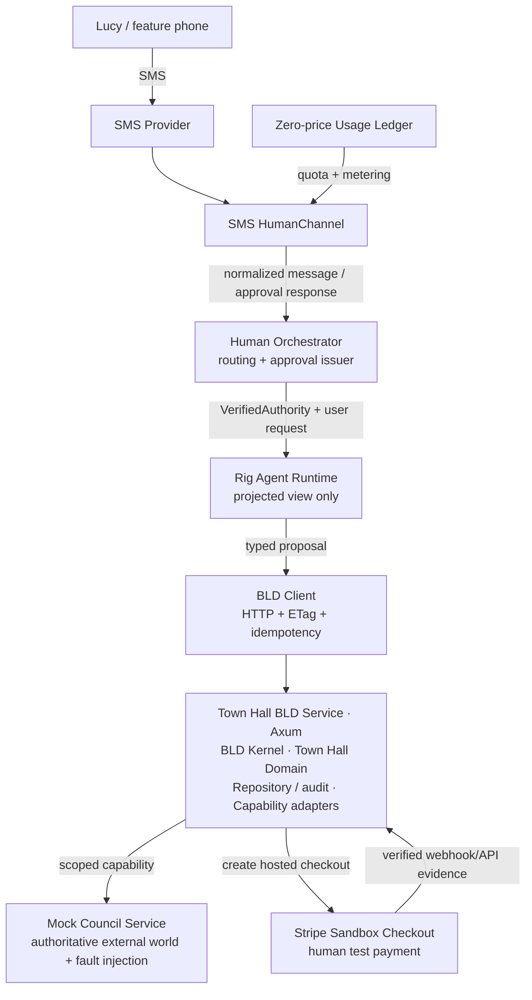

**Boundary-Led Development**

**Town Hall Vertical Slice**

Technical Specification & Iterative Development Roadmap

**Version 0.4.2 | August 2026**

*SMS-first human channel + zero-price usage units + human payment handoff*

Execution contract for a downstream coding agent

> **Purpose**  
> This document is the execution contract for the first end-to-end BLD proof of concept. Implement milestone by milestone. Every layer must be testable before a dependent layer is added.

Source basis: Boundary-Led Development Open Draft v0.1, the town-hall architecture decisions, and the SMS-first / zero-price usage / human-payment-handoff design decisions developed in August 2026.

# 1. Executive Summary

The first BLD implementation is a vertically integrated town-hall booking demonstration. The goal is not to build the entire future BLD ecosystem in one month. The goal is to prove, with executable software, that a probabilistic agent can be useful while deterministic boundaries retain consequential authority.

Version 0.4.2 keeps the first human interface SMS-first through a channel-agnostic HumanChannel. A person can text from a feature phone or smartphone, approve a bounded action through an explicit challenge, receive progress/results by SMS, modify requirements, cancel, and receive a secure payment link when a service requires direct human financial consent. The BLD agent, kernel, domain and service remain channel-independent.

BLD platform usage units are metered but have a monetary price of £0 in the POC. This preserves quotas, idempotent accounting and anti-loop resource bounds without requiring a top-up portal, carrier billing or real platform billing. Higher-value purchases use a separate human-payment handoff: the service prepares a canonical checkout, sends a Stripe sandbox Checkout URL into the SMS thread, and resumes only after verified payment-provider evidence.

> **Central invariant**  
> A probabilistic component proposes; a deterministic boundary disposes. The communication channel does not create authority. Funding does not create authority. Only independently verified authority plus current authoritative state can permit a consequential transition.

## 1.1 Month-one deliverables

- A reusable Rust BLD kernel with deterministic Undefined / Denied / Committed semantics and an exhaustive test suite.

- A town-hall booking domain with explicit states, state-scoped behaviours, typed plans, evidence and errors.

- Durable persistence, optimistic concurrency, idempotent effect identity, audit events and recovery/reconciliation.

- A mock council backend representing the external world and supporting fault injection.

- An Axum BLD service exposing the domain over HTTP with ETag/If-Match and a discovery manifest.

- A channel-agnostic HumanChannel abstraction plus an SMS simulator and one real SMS-provider adapter.

- An explicit SMS approval-challenge flow that produces VerifiedAuthority with an assurance level; prompt text and caller number alone are never authority.

- A zero-price usage-unit ledger with deterministic metering, idempotent UsageIntentId semantics, quotas and zero-unit safety exits.

- A Rig-based agent that sees only BLD projections and submits typed proposals; it never receives raw council capabilities.

- A Stripe sandbox human-payment handoff proving AwaitingHumanPayment -> verified payment evidence -> workflow continuation without giving the agent payment credentials.

- A deterministic hostile-proposer and failure-injection demo showing that invariants survive bad agent behaviour.

## 1.2 Explicit non-goals for month one

- Premium-rate SMS, carrier billing, or dependency on Ofcom PRS provisioning.

- A production OAuth authorization server, enterprise IAM or production-grade credential issuance.

- A production marketplace or public registry. The demo uses a tiny local catalogue plus a signed service manifest.

- Real government integration or real settlement of the town-hall fee.

- Using BLD usage units as transferable money, cash-equivalent value, or a means to pay unrelated third-party merchants. POC units have zero monetary price.

- A production wallet/passkey application. Stronger approval methods remain future HumanApproval adapters.

- A multi-language BLD SDK.

- Blockchain governance, staking, slashing or a decentralized registry.

- Formal verification of the full implementation.

- A claim that registry verification certifies that a boundary is safe.

## 1.3 What the demo must prove

- A natural-language request can be translated into typed BLD proposals without giving the model direct consequential capabilities.

Model independence is a required property of the POC. At least one locally hosted/open-source model must complete the reference town-hall booking and cancellation journey. Model/provider selection is configuration, not architecture; swapping the proposer must not change the legal transition graph, authority model, capability surface or boundary tests.

- SMS is merely a transport and interaction surface; it does not become the source of authority.

- A user can approve a narrow delegation without a smartphone app.

- A user can modify or cancel work later using the latest authoritative resource state.

- Zero-price usage units still bound resource consumption and duplicate charging/metering without determining which business actions are authorized.

- Model replacement, stale work, duplicate retries, forged evidence and hostile proposals cannot bypass deterministic boundaries.

# 2. Engineering Principles and Execution Rules

These rules are normative. A downstream coding agent should not trade them away for convenience.

| **Rule**                                           | **Meaning**                                                                                                                                             |
|----------------------------------------------------|---------------------------------------------------------------------------------------------------------------------------------------------------------|
| Build dependency-first                             | Every milestone must be independently runnable and testable before a layer that depends on it is introduced.                                            |
| No AI in the kernel                                | The kernel is deterministic Rust. The model is outside the trusted commit path.                                                                         |
| No HTTP or SMS logic in the domain                 | The town-hall state machine must be executable in unit tests without Axum, an SMS provider, or Rig.                                                     |
| No direct external capabilities for the agent      | The Rig agent may inspect BLD projections and submit proposals, but may not call council booking/cancellation APIs directly.                            |
| Proposal does not carry authority                  | Authority arrives through an independently verified grant, never from prompt text, caller ID or model-generated claims.                                 |
| Channel does not equal identity                    | A phone number is a routing identifier and one authentication signal, not proof of high-assurance identity by itself.                                   |
| Usage metering does not grant authority            | Usage units are £0 in the POC and only bound resource consumption; they do not authorize business actions.                                              |
| Canonical plans are boundary-derived               | Venue, slot, fee, effect ID and principal are loaded or derived from authoritative state/context.                                                       |
| Durable state is not conversational memory         | The booking resource/version live in persistent storage. Agent/chat memory is only a routing aid.                                                       |
| All public mutations are version-checked           | Every state-changing API request uses optimistic concurrency. Stale work must lose authority to commit.                                                 |
| Effects have stable identity                       | Retries use the same effect intent ID. Request IDs are tracing identifiers, not effect identity.                                                        |
| Usage metering has stable identity                 | A UsageIntentId is metered at most once across retries; quota may never silently go negative.                                                           |
| Unknown is not success                             | Unavailable verification, provider ambiguity and reconciliation uncertainty remain explicit.                                                            |
| Cancellation is a proposal, not a thread kill      | Cancellation changes authoritative state or initiates compensation/reconciliation according to current state.                                           |
| STOP is channel control, not business cancellation | Stopping SMS messages or an agent session must not silently mutate a booking. Booking cancellation is explicit domain behaviour.                        |
| Safety exits are not paywalled                     | STOP, HELP, REVOKE and the POC booking-cancel path are zero-unit operations.                                                                            |
| Tests are part of the boundary                     | Topology, hostile proposer, race, crash/retry, authority, usage-metering, payment-evidence/replay and evidence-forgery tests are required deliverables. |
| Human payment is first-class state                 | Above configured risk/value threshold, the service enters AwaitingHumanPayment and resumes only from verified provider evidence.                        |

> **Milestone gate**  
> Do not begin milestone N+1 until milestone N compiles, its required tests pass, and the milestone demo can be exercised through its public interface.

# 3. Target Vertical-Slice Architecture

**Figure 1. Target vertical-slice architecture**



## 3.1 Human interface is an adapter, not the architecture

BLD must not be coupled to an app. The first implementation is SMS because it works on feature phones and reduces UI work, but the same HumanChannel contract should later support web, mobile, WhatsApp, voice or other channels without changing the kernel or town-hall domain.

Conversation state may remember the most recent BookingId to interpret phrases such as “cancel it”, but before a proposal is issued the orchestrator must reload the current booking and version. If more than one booking is a plausible referent, the system asks the user to choose rather than guessing.

## 3.2 Trust boundary

| **Component**                            | **Trust posture**                                                    | **May mutate authoritative booking state?**                      |
|------------------------------------------|----------------------------------------------------------------------|------------------------------------------------------------------|
| SMS sender / message text                | Untrusted human input surface                                        | No                                                               |
| SMS provider metadata                    | Transport evidence; useful but not high-assurance identity by itself | No                                                               |
| HumanChannel adapter                     | Trusted parser/normalizer only; must not invent authority            | No                                                               |
| Approval verifier / authority issuer     | Trusted authority component                                          | Issues VerifiedAuthority; does not mutate booking                |
| Usage ledger                             | Trusted resource-accounting component                                | May reserve/meter/release units; no booking mutation             |
| Rig agent / model                        | Untrusted proposer                                                   | No                                                               |
| BLD client                               | Untrusted driver; must not bypass server checks                      | No                                                               |
| Axum handlers                            | Thin transport adapter                                               | No direct mutation                                               |
| Booking service / repository transaction | Trusted commit coordinator                                           | Only through kernel outcome + version check                      |
| BLD kernel                               | Trusted sequencing core                                              | Determines commit eligibility                                    |
| Town-hall domain                         | Trusted domain policy/topology                                       | Derives plans / next state, no storage write                     |
| Capability adapters                      | Trusted or independently verified effect boundary                    | External effects only, not DB state                              |
| Mock council                             | Authoritative external-world simulator                               | Owns council-side booking records                                |
| Stripe sandbox / payment verifier        | External payment evidence source + trusted verifier adapter          | No direct booking mutation; supplies Verified<PaymentEvidence> |

# 4. Repository and Workspace Layout

Use one Rust workspace plus lightweight web assets. Keep the kernel dependency-light and reusable.

```text
bld-townhall/
├── Cargo.toml
├── README.md
├── docs/
│ ├── architecture.md
│ ├── state-machine.md
│ ├── authority.md
│ ├── usage-units.md
│ ├── payment-handoff.md
│ └── demo-script.md
├── crates/
│ ├── bld-kernel/
│ ├── bld-types/
│ ├── townhall-domain/
│ ├── townhall-store/
│ ├── council-client/
│ ├── bld-http/
│ ├── townhall-server/
│ ├── authority/
│ ├── human-channel/
│ ├── sms-adapter/
│ ├── usage-ledger/
│ ├── payment-handoff/
│ ├── stripe-test-adapter/
│ ├── bld-client/
│ └── agent-runtime/
├── services/
│ ├── mock-council/
│ └── sms-simulator/
├── fixtures/
│ └── venues.json
└── tests/
├── integration/
├── adversarial/
└── recovery/
```

## 4.1 Technology choices

| **Area**              | **Choice**                                          | **Rationale**                                                                                   |
|-----------------------|-----------------------------------------------------|-------------------------------------------------------------------------------------------------|
| Language/runtime      | Rust + Tokio                                        | Reference kernel goal; ownership/concurrency semantics.                                         |
| HTTP server           | Axum                                                | Thin async handlers and typed extractors.                                                       |
| Agent framework       | Rig                                                 | Rust-native model/provider abstraction and structured tool integration.                         |
| HTTP client           | reqwest                                             | Async BLD/mock-council calls.                                                                   |
| Serialization         | serde + serde_json                                  | Typed bounded wire formats.                                                                     |
| Persistence           | SQLite via SQLx for POC                             | Single-file durability and transactions; repository trait preserves Postgres path.              |
| Human channel         | Provider-agnostic SMS trait                         | Use simulator first; real provider only after channel tests pass.                               |
| Authority approval    | Challenge + VerifiedApproval -> VerifiedAuthority  | SMS reply is evidence at a defined assurance level; wallet/passkey adapters can be added later. |
| Usage metering        | Append-oriented zero-price unit ledger              | Deterministic resource guard independent of authority or real billing.                          |
| Human payment handoff | Stripe sandbox Checkout                             | Hosted test checkout + provider evidence without exposing payment credentials to the agent.     |
| Service discovery     | /.well-known/bld + local signed manifest            | Enough to demonstrate marketplace direction without public registry.                            |
| Testing               | Rust unit/integration/property tests + HTTP/SMS E2E | Boundary claims must be deterministic and regressible.                                          |

Dependency versions should use current stable mutually compatible releases at implementation time. Avoid unnecessary version pinning in this specification.

# 5. BLD Core Types and Kernel Contract

The kernel stays domain-agnostic. It owns sequencing semantics, not town-hall rules, SMS, billing or model logic.

```rust
pub enum BoundaryOutcome<S, E> {
Undefined,
Denied(E),
Committed(S),
}

pub enum Resolution<P, E> {
Undefined,
Denied(E),
Ready(P),
}

#[async_trait::async_trait]
pub trait BoundaryDomain: Send + Sync {
type State: Send + Sync;
type Proposal: Send;
type Authority: Send + Sync;
type Context: Send;
type Plan: Send;
type Evidence: Send;
type Error: Send;

async fn resolve(
&self,
state: &Self::State,
proposal: Self::Proposal,
authority: &Self::Authority,
context: &Self::Context,
) -> Resolution<Self::Plan, Self::Error>;

async fn execute(
&self,
plan: &Self::Plan,
context: &mut Self::Context,
) -> Result<Self::Evidence, Self::Error>;

async fn validate(
&self,
current: &Self::State,
plan: &Self::Plan,
evidence: &Self::Evidence,
context: &Self::Context,
) -> Result<Self::State, Self::Error>;
}
```

Audit and durable commit coordination live outside the domain trait or in a small kernel-owned extension. Domain code must not write directly to storage.

## 5.1 Kernel sequencing

```text
proposal
-> resolve current-state behaviour
-> Undefined if behaviour does not exist
-> Denied if authority/policy/context fails
-> Ready(canonical plan)
-> persist effect intent when plan has external side effect
-> execute narrow capability
-> receive evidence
-> validate evidence
-> append audit event
-> atomic compare-and-set commit: version N -> N+1
-> return Committed(next)
-> reconcile external effects independently
```

## 5.2 Provenance vocabulary

| **Wrapper**           | **Meaning**                                                         | **Example**                                                   |
|-----------------------|---------------------------------------------------------------------|---------------------------------------------------------------|
| AgentClaim<T>       | Untrusted content derived from model/user conversation.             | Agent claims a venue costs £45.                               |
| Authoritative<T>    | Loaded from a trusted system-of-record capability.                  | Council catalogue returns fee £45.                            |
| Verified<T>         | Evidence checked against an external authority.                     | Booking reference is confirmed by council lookup.             |
| VerifiedApproval<T> | Human approval evidence validated by a channel/credential verifier. | SMS challenge 7312 answered within expiry from bound channel. |

# 6. Town Hall Domain Model

## 6.1 Primary aggregate

```rust
BookingAggregate {
id: BookingId,
version: u64,
state: BookingState,
requirements: BookingRequirements,
selected_venue: Option<SelectedVenue>,
availability: Option<VerifiedAvailability>,
booking_ref: Option<CouncilBookingRef>,
active_effect: Option<EffectIntentId>,
created_at: Timestamp,
updated_at: Timestamp,
}
```

## 6.2 Requirements

```rust
BookingRequirements {
purpose: BoundedString,
requested_date: LocalDate,
time_window: TimeWindow,
attendees: u16,
wheelchair_accessible: bool,
max_fee: Money,
}
```

The original request captures user preferences. Authority limits are separate and may be stricter. The effective allowed fee is the minimum of the resource/user requirement and verified delegated authority.

# 7. State Machine and State-Scoped Behaviours

```text
Draft
├─ select_venue ───────────────> VenueSelected
└─ cancel ─────────────────────> Cancelled

VenueSelected
├─ verify_slot ────────────────> AwaitingBooking
├─ change_venue ───────────────> Draft
├─ update_requirements ────────> NeedsRevalidation
└─ cancel ─────────────────────> Cancelled

NeedsRevalidation
├─ revalidate_venue ───────────> VenueSelected
├─ change_venue ───────────────> Draft
└─ cancel ─────────────────────> Cancelled

AwaitingBooking
├─ book ───────────────────────> BookingInProgress
├─ change_venue ───────────────> Draft
├─ update_requirements ────────> NeedsRevalidation
└─ cancel ─────────────────────> Cancelled

BookingInProgress
├─ booking_confirmed ──────────> Booked
├─ booking_failed ─────────────> AwaitingBooking
└─ cancel ─────────────────────> CancellationRequested

CancellationRequested
├─ no_booking_found ───────────> Cancelled
├─ booking_found ──────────────> CancellingBooking
└─ reconciliation_failed ──────> NeedsHuman

Booked
├─ cancel ─────────────────────> CancellingBooking
└─ view_booking ───────────────> Booked (read-only)

CancellingBooking
├─ cancellation_confirmed ─────> Cancelled
├─ cancellation_failed ────────> Booked
└─ reconciliation_failed ──────> NeedsHuman

Cancelled [terminal]
NeedsHuman [human-owned terminal for automated execution]
```

## 7.1 Proposal vocabulary

```rust
enum BookingProposal {
SelectVenue { venue_id: VenueId, slot_id: SlotId },
VerifySlot,
ChangeVenue,
UpdateRequirements(RequirementsPatch),
RevalidateVenue,
Book,
Cancel { reason: CancellationReason },
Reconcile,
}
```

## 7.2 State-scoped implementation rule

Behaviours belong to the concrete state type. A behaviour that does not exist for a state should ideally have no method on that state. Runtime enum matching maps invalid state/proposal pairs to Resolution::Undefined.

```rust
impl AwaitingBooking {
fn book(
&self,
authority: &VerifiedAuthority,
ctx: &BookingContext,
) -> Result<BookingPlan, BookingError> {
// reload authoritative facts
// check authority and expiry
// derive stable effect intent and provider parameters
}
}

impl Draft {
// select_venue()
// cancel()
// deliberately no book()
}
```

# 8. Plans, Capabilities and Evidence

The model must never choose raw provider parameters for consequential effects. A successful resolve step returns a canonical plan derived from authoritative resource state and verified authority.

```rust
BookingPlan {
effect_intent_id: EffectIntentId,
booking_id: BookingId,
principal: PrincipalId,
venue_id: VenueId,
slot_id: SlotId,
attendees: u16,
fee: Money,
}
```

## 8.1 Capability contracts

- VenueCatalogueCapability: authoritative venue/capacity/accessibility/fee lookup.

- AvailabilityCapability: authoritative slot availability with validity window.

- BookingCapability: execute exactly one canonical BookingPlan by stable EffectIntentId.

- CancellationCapability: cancel a verified existing council booking with stable cancellation intent.

- ReconciliationCapability: query provider state by effect intent / booking reference when local outcome is uncertain.

## 8.2 Evidence rule

Evidence is valid because of provenance, not shape. The provider adapter returns evidence; validation must bind it to the same effect intent, venue, slot, fee and principal where applicable. Field-perfect model forgeries must fail.

# 9. Persistence, Versioning and Stable Identity

| **Table**           | **Purpose**                                                                                                      |
|---------------------|------------------------------------------------------------------------------------------------------------------|
| bookings            | Current aggregate snapshot: id, version, state discriminator, state payload, timestamps.                         |
| effect_intents      | Stable external-effect identity, canonical plan hash/data, status, provider reference.                           |
| audit_events        | Append-oriented transition/effect events with identifiers, versions, proposal, outcome and evidence summary.     |
| principals          | Internal principal IDs; phone numbers should not be the durable principal key.                                   |
| channel_bindings    | Phone/channel address -> principal mapping, status, verification metadata and assurance.                        |
| approval_challenges | Nonce/code, principal, requested scope, expiry, attempts and status.                                             |
| delegations         | Verified authority envelope, expiry/revocation, delegate/service/scope/constraints.                              |
| usage_accounts      | Usage account linked to principal; current denormalized balance optional.                                        |
| usage_ledger        | Append-oriented reserve/debit/release/refund/adjustment events keyed by UsageIntentId; monetary price £0 in POC. |
| payment_intents     | Stable PaymentIntentId, canonical checkout data/hash, provider Checkout Session reference, status and expiry.    |
| reconciliation_jobs | Outstanding ambiguous or incomplete effects requiring verification.                                              |
| payment_events      | Verified/rejected provider webhook/API evidence with dedupe key and PaymentIntentId binding.                     |

## 9.1 Identifier semantics

| **Identifier**      | **Scope**                            | **Retry / security behaviour**                                            |
|---------------------|--------------------------------------|---------------------------------------------------------------------------|
| RequestId           | One HTTP/SMS processing attempt      | Changes on retry; tracing only.                                           |
| MessageId           | One inbound/outbound channel message | Provider/local dedupe; not authority.                                     |
| ConversationId      | Routing context                      | May point to active resources; never authoritative business state.        |
| PrincipalId         | Durable human/service principal      | Stable; not equal to mutable phone number.                                |
| BookingId           | Durable business resource            | Stable for resource lifetime.                                             |
| EffectIntentId      | One intended external consequence    | Stable across retries/recovery.                                           |
| ResourceVersion     | Authoritative resource revision      | Increments on every committed resource change.                            |
| ApprovalChallengeId | One approval request                 | One-time use; expires; bounded attempts.                                  |
| DelegationId        | One verified authority grant         | Stable until expiry/revocation; never derived from prompt text.           |
| UsageIntentId       | One metered BLD usage event          | Same intent may debit/meter at most once across retries.                  |
| PaymentIntentId     | One intended human payment handoff   | Stable across retries; bound to canonical checkout and provider evidence. |

## 9.2 Optimistic concurrency

All booking mutations load version N and commit with an atomic compare-and-set. If another mutation commits first, the stale writer must fail and reload. In HTTP this is represented with ETag/If-Match. The database remains the final authority.

```sql
UPDATE bookings
SET state_payload = ?, version = version + 1, updated_at = ?
WHERE id = ? AND version = ?;
```

# 10. Town Hall HTTP API

| **Method / path**                                         | **Purpose**                                                                  |
|-----------------------------------------------------------|------------------------------------------------------------------------------|
| POST /booking-intents                                     | Create durable booking intent and initial requirements.                      |
| GET /booking-intents/{id}                                 | Read authoritative booking projection + ETag + available behaviours.         |
| GET /venues?...                                           | Read-only authoritative venue search.                                        |
| POST /booking-intents/{id}/behaviours/select-venue        | Select a venue/slot against current version.                                 |
| POST /booking-intents/{id}/behaviours/verify-slot         | Re-verify authoritative availability.                                        |
| POST /booking-intents/{id}/behaviours/update-requirements | Change requirements; invalidate dependent evidence as required.              |
| POST /booking-intents/{id}/behaviours/book                | Request booking; body empty/minimal because parameters are boundary-derived. |
| POST /booking-intents/{id}/behaviours/cancel              | Cancel/compensate according to current state.                                |
| POST /booking-intents/{id}/behaviours/reconcile           | Demo/admin endpoint to drive deterministic reconciliation.                   |
| GET /booking-intents/{id}/audit                           | Read structured audit trail for demo/debug.                                  |

## 10.1 Standard headers

| **Header**       | **Use**                                                                                            |
|------------------|----------------------------------------------------------------------------------------------------|
| Authorization    | Carries agent/service authentication as required by the POC.                                       |
| X-BLD-Delegation | Carries or references the verified delegation envelope.                                            |
| If-Match         | Required on mutation; expected resource ETag/version.                                              |
| ETag             | Returned with current resource representation/version.                                             |
| X-Request-ID     | One transport attempt for tracing.                                                                 |
| Idempotency-Key  | Client-visible intent key for mutating request; external effect identity remains boundary-derived. |

## 10.2 Outcome mapping

| **Condition**                          | **HTTP** | **BLD meaning**                                        |
|----------------------------------------|----------|--------------------------------------------------------|
| Unauthenticated                        | 401      | No verified caller identity.                           |
| Authority denied                       | 403      | Behaviour may exist, but caller/grant is insufficient. |
| Behaviour absent in current state      | 409      | BoundaryOutcome::Undefined.                            |
| Stale If-Match                         | 412      | Resource changed since caller observed it.             |
| Invalid domain data                    | 422      | Typed validation/guard denial.                         |
| Resource/retry budget exhausted        | 429      | Bounded liveness/resource guard.                       |
| Verifier/provider unavailable          | 503      | Uncertainty; never mapped to success.                  |
| Committed synchronously                | 200/201  | State committed.                                       |
| External effect started but unresolved | 202      | Durable intent exists; reconciliation required.        |

# 11. Mock Council Service

The mock council is intentionally separate from the BLD service so the demo has an actual provenance boundary. It owns venue facts, slots and council-side booking records.

| **Endpoint**                      | **Behaviour**                                                                              |
|-----------------------------------|--------------------------------------------------------------------------------------------|
| GET /venues                       | Search fixed fixture catalogue.                                                            |
| GET /venues/{venue}/slots/{slot}  | Return authoritative availability, fee, accessibility/capacity facts and validity window.  |
| POST /bookings                    | Create exactly one booking per stable effect intent; repeated key returns original result. |
| GET /effects/{effect_intent_id}   | Lookup external-world result for reconciliation.                                           |
| POST /bookings/{reference}/cancel | Cancel exactly once; duplicate cancellation returns canonical result.                      |
| POST /test/faults                 | Test-only fault injection: delay, drop response after commit, malformed evidence, outage.  |

| **Venue**            | **Capacity** | **Accessible** | **Fee** | **Demo role**                 |
|----------------------|--------------|----------------|---------|-------------------------------|
| TH-A Council Chamber | 30           | Yes            | £45     | Valid happy-path venue.       |
| TH-B Heritage Room   | 25           | No             | £35     | Fails wheelchair requirement. |
| TH-C Civic Hall      | 80           | Yes            | £90     | Fails £50 authority/budget.   |
| TH-D Meeting Room    | 12           | Yes            | £20     | Fails attendee capacity.      |

# 12. BLD Discovery and Local Marketplace Catalogue

The POC needs discovery but not a production marketplace. The town-hall service publishes a signed manifest and a local catalogue can list it. Registry verification means publisher/authenticity/integrity/conformance metadata, not a guarantee of safety.

```http
GET /.well-known/bld

{
"bld_version": "0.2",
"service": "demo-town-hall-booking",
"publisher": "demo-council",
"resources": ["booking-intents"],
"concurrency": "etag-if-match",
"authority_profile": "bld-demo-delegation-v1",
"manifest_digest": "..."
}
```

# 13. Authority, Approval and Delegation

The POC must separate principal, actor, channel, approval evidence and delegated authority. A phone message can request an action, but the text itself does not authorize the action.

```rust
VerifiedAuthority {
delegation_id: DelegationId,
principal: PrincipalId,
actor: ActorId,
service: ServiceId,
behaviours: Set<Behaviour>,
constraints: AuthorityConstraints,
issued_at: Timestamp,
expires_at: Timestamp,
approval_assurance: AssuranceLevel,
}
```

## 13.1 SMS approval challenge

**1.** Orchestrator derives a permission preview from the user request and the target BLD service.

**2.** Authority service creates ApprovalChallengeId, random one-time code, canonical scope hash, expiry and bounded attempt count.

**3.** SMS sends the preview and asks the user to reply with an explicit code, for example \`YES 7312\`.

**4.** HumanChannel returns the reply plus provider metadata to ApprovalVerifier.

**5.** ApprovalVerifier checks challenge, code, expiry, channel binding and replay status; it emits VerifiedApproval.

**6.** AuthorityIssuer converts VerifiedApproval plus canonical requested scope into VerifiedAuthority.

**7.** Agent receives only the resulting narrow authority reference/grant, never an SMS-derived “trust me” flag.

For the POC, SMS approval has a defined assurance level and is suitable only for the town-hall demo risk profile. Higher-consequence services can require a stronger approval adapter such as passkey, wallet signature, bank SCA or organization IAM without changing BLD kernel semantics.

## 13.2 Example permission preview

```text
BLD booking request
Service: Demo Council Town Hall Booking
Agent: TownHallAgent
May: book one meeting room; cancel that booking
Date: Thu 20 Aug 2026
Time: 13:00-17:00
Attendees: <= 20
Wheelchair access: required
Maximum booking fee: £50.00
Permission expires: 17:00 Thu 20 Aug

Reply YES 7312 to approve.
Reply NO 7312 to reject.
```

# 14. HumanChannel Abstraction

HumanChannel normalizes human communication into typed inbound/outbound events. It must not own booking state, policy, authority or model decisions.

```rust
#[async_trait]
pub trait HumanChannel: Send + Sync {
type Address: Send + Sync;

async fn receive(&self, raw: RawInbound) -> Result<InboundMessage, ChannelError>;
async fn send(&self, to: &Self::Address, msg: OutboundMessage)
-> Result<MessageReceipt, ChannelError>;
}

InboundMessage {
message_id: MessageId,
channel: ChannelKind,
address: ChannelAddress,
received_at: Timestamp,
body: BoundedString,
transport_evidence: TransportEvidence,
}
```

## 14.1 Channel-control vocabulary

| **Command**                              | **Meaning**                                                                                           | **Unit cost** |
|------------------------------------------|-------------------------------------------------------------------------------------------------------|---------------|
| HELP                                     | Return usage/help instructions.                                                                       | 0             |
| BALANCE                                  | Return current BLD usage-credit balance.                                                              | 0             |
| STOP                                     | Stop automated/non-essential outbound messaging and scheduled agent turns. Does NOT cancel a booking. | 0             |
| START                                    | Re-enable permitted messaging after channel verification where applicable.                            | 0             |
| REVOKE                                   | Revoke active delegations for this principal/channel after verification.                              | 0             |
| CANCEL <ref> / natural language cancel | Create a booking cancellation proposal after authoritative resource lookup.                           | 0 in POC      |

If the user writes “cancel it” and more than one active resource is plausible, the orchestrator must ask which booking. Conversation memory may suggest candidates but cannot choose a consequential resource ambiguously.

# 15. SMS-First Experience

SMS is the first real HumanChannel adapter because it works on feature phones and requires no app installation. The system should be provider-agnostic: start with an in-process SMS simulator, then add one provider webhook/REST adapter after channel behaviour is proven.

## 15.1 Required SMS behaviours

- Inbound message deduplication by provider message ID plus bounded replay window.

- Normalization of E.164 addresses without treating the address as the durable principal ID.

- Explicit message-length and segment-count bounds; reject or summarize oversized model output.

- One-time approval codes; bounded attempts; expiry; replay prevention.

- Rate limits per principal/channel plus global provider budget.

- No secrets, raw signatures or unnecessary PII in logs.

- Outbound delivery failures represented explicitly; they do not roll back already committed business state.

- Channel STOP/HELP/BALANCE handled deterministically before invoking the LLM.

- Booking cancellation remains a BLD domain proposal and reloads latest state/version.

## 15.2 Example SMS journey

```text
Lucy -> BLD:
Book a town hall next Thursday afternoon for 20 people.
It must be wheelchair accessible and under £50.

BLD -> Lucy:
I can ask TownHallAgent to make one booking matching those limits.
Maximum booking fee: £50. Reply YES 7312 to approve.

Lucy -> BLD:
YES 7312

BLD -> Lucy:
Approved. I found Council Chamber A, Thu 2-5pm, £45.
Booking now. Ref: BKG-1001

BLD -> Lucy:
Booked. Council ref TH-92718.
Reply CANCEL TH-92718 at any time to cancel.

[20 minutes later]
Lucy -> BLD:
Cancel it

BLD -> Lucy:
Cancelled. Council ref TH-92718.
```

# 16. Zero-Price BLD Usage Units

The POC meters BLD platform usage but charges £0 for units. This preserves resource accounting, quotas, retry/idempotency semantics and bounded agent loops without requiring carrier billing, stored value, a top-up website or live billing. Units do not pay the underlying town-hall or other merchant fee.

> **Separation rule**  
> Credits answer “does this account have enough prepaid BLD usage?” Authority answers “may this agent perform this business action?” Neither substitutes for the other.

## 16.1 Usage-account model

```rust
UsageAccount {
id: UsageAccountId,
principal: PrincipalId,
status: UsageAccountStatus,
}

UsageLedgerEntry {
entry_id: LedgerEntryId,
account_id: UsageAccountId,
kind: Reserve | Debit | Release | Refund | Adjustment,
units: i64,
usage_intent_id: Option<UsageIntentId>,
created_at: Timestamp,
}
```

## 16.2 Metering semantics

- PricingSchedule is versioned and deterministic. For the POC, the monetary price of every BLD usage unit is £0.

- Use simple metering, for example fixed units per LLM turn and/or per completed task. The purpose is resource accounting and bounded liveness, not revenue collection.

- Before a metered step, reserve the maximum units required for that step; on completion settle actual usage and release unused reservation if supported.

- UsageIntentId makes metering idempotent. Retrying the same step cannot debit/meter twice.

- Configured quota may not silently go negative. Exhausted quota returns a typed resource denial before a chargeable/metered model/tool step.

- System failure before consumption releases/rescinds reservation according to deterministic policy.

- STOP, HELP, BALANCE, REVOKE and booking cancellation are zero-unit operations in the POC so users cannot be trapped behind an exhausted quota.

## 17. Human Payment Handoff (Stripe Sandbox)

For high-value or high-risk commerce, the agent prepares the transaction but the human completes payment directly. The BLD service derives a canonical checkout and transitions to AwaitingHumanPayment; the SMS thread contains a Stripe sandbox Checkout link.

The boundary derives amount, currency, merchant/service, resource identity and PaymentIntentId from authoritative state and policy. The model cannot choose raw payment destination or authoritative amount.

The agent never receives card details, wallet keys, bank credentials or payment-signing capability. Opening the link transfers payment interaction to Stripe-hosted test Checkout.

A success redirect or an agent statement that payment succeeded is not evidence. The workflow advances only after verified Stripe webhook/API evidence bound to the expected PaymentIntentId / Checkout Session.

Duplicate webhook delivery and retries are idempotent. Checkout expiry, cancellation or provider uncertainty remain explicit states and cannot silently become PaymentConfirmed.

The threshold deciding whether an agent may continue automatically or must enter AwaitingHumanPayment is deterministic service/user policy. For the POC, use a fixed configurable threshold/high-value fixture.

17.1 Required state pattern: OfferSelected -> CheckoutPrepared -> AwaitingHumanPayment -> PaymentConfirmed (verified provider evidence only) -> BookingInProgress -> Booked; expiry/cancel remain explicit exits.

| **Phase**          | **Required**                                                                                                                  | **Not required**                                                                                             |
|--------------------|-------------------------------------------------------------------------------------------------------------------------------|--------------------------------------------------------------------------------------------------------------|
| Month-one POC      | Zero-price usage ledger, quotas, UsageIntentId idempotency, Stripe sandbox Checkout, verified payment webhook/API evidence.   | Carrier billing, premium SMS, paid platform units, top-up portal, live card settlement, stored-value wallet. |
| Post-POC           | Production payment processor mode, paid usage model if desired, refunds/support, fraud controls and legal/accounting review.  | Still no need for carrier billing unless intentionally chosen as another funding adapter.                    |
| Future marketplace | Service-specific payment policies, stronger SCA/approval adapters and settlement/compliance design for independent providers. | Do not assume the zero-price POC or closed-loop assumptions apply to production marketplace payments.        |

# 18. Rig Agent Runtime and Model Independence

Rig is used only on the proposer side. It handles model/provider plumbing and structured tool calling; it is not part of the BLD authority boundary. The default reference proposer must use at least one locally hosted/open-source model. A proprietary/frontier model may be configured for comparison, but is not a POC dependency.

## 18.1 Model responsibilities

The model has a deliberately narrow role: interpret natural-language SMS input, extract or request missing non-authoritative constraints, inspect the projected BLD state and available behaviours, choose the next typed proposal, and explain boundary outcomes to the human.

The model must not decide authoritative prices, permission scope, resource versions, payment status, provider parameters, idempotency/effect IDs, or whether an external effect succeeded.

## 18.2 Model-independence acceptance criterion

- At least one locally hosted/open-source model completes the happy booking and 20-minute-later cancellation journey.

- Swapping the proposer implementation does not change the legal transition graph, authority requirements or capability surface.

- Hostile, stale and forged proposals remain contained independently of model choice.

- Model-specific failures may reduce proposal quality or trigger clarification, but must not enlarge authority or corrupt authoritative state.

## 18.3 Tools exposed to the agent

- Inspect BLD service discovery metadata.

- Create/read a booking intent through the BLD client.

- Inspect authoritative resource projection and available behaviours.

- Search authoritative venue candidates through permitted read-only BLD surface.

- Submit one typed BLD proposal with a verified delegation reference and latest ETag.

- Never expose raw council booking/cancellation APIs, repository access, pricing ledger mutation, or signing keys.

Also implement a deterministic HostileProposer that bypasses LLM niceness and directly emits malicious proposals against exactly the same BLD public surface. The same boundary/adversarial suite must run regardless of proposer implementation so safety claims are about the boundary, not model obedience.

# 19. Threat Model and Required Invariants

The POC demonstrates containment of bad proposer behaviour within the implemented service boundary. It is not a universal security guarantee.

## 19.1 Required invariants

- No booking can be committed from a state where Book behaviour is absent.

- No booking above the verified maximum fee may be externally executed.

- No inaccessible venue may be booked when accessibility is required.

- No venue below required capacity may be booked.

- No model-supplied fee, booking reference or receipt becomes authoritative because its fields look correct.

- Two concurrent transitions based on the same resource version cannot both commit.

- A repeated external EffectIntentId cannot create duplicate council bookings.

- A booking that may have succeeded externally but has uncertain local outcome is reconciled before a contradictory final state is committed.

- Cancellation during an in-flight booking cannot erase history or pretend the external effect never happened.

- An expired/tampered/wrong-audience delegation cannot authorize a consequential transition.

- A phone number or SMS body alone cannot mint high-assurance authority.

- An approval challenge cannot be replayed or reused to create a second delegation.

- The same UsageIntentId cannot be metered twice across retries.

- A payment cannot become PaymentConfirmed from model text, SMS text, or a success redirect; verified provider evidence is required.

- Duplicate payment webhooks/retries cannot create duplicate payment transitions or duplicate external bookings.

- Agent/model replacement cannot enlarge the legal transition graph, payment authority or capability surface.

- At least one locally hosted/open-source model must complete the happy booking/cancellation flow through the same public BLD interfaces used by every other proposer.

# 20. Test Strategy

The test suite is a first-class product. The demo should switch between a locally hosted/open-source helpful model, an optional alternate proposer, and a deterministic hostile proposer while preserving the same invariants.

| **Layer**            | **Required tests**                                                                                                                                                                               |
|----------------------|--------------------------------------------------------------------------------------------------------------------------------------------------------------------------------------------------|
| Kernel               | Undefined/Denied/Committed sequencing; no commit on failure; execute/validate ordering.                                                                                                          |
| Domain topology      | Exhaustive state × proposal matrix; every pair explicitly classified.                                                                                                                            |
| Policy/authority     | Fee, expiry, scope, audience, delegate, service, accessibility/capacity guards.                                                                                                                  |
| Approval             | Wrong/expired/replayed SMS code; wrong channel; challenge attempt limit; one challenge -> at most one grant.                                                                                    |
| HumanChannel         | Inbound dedupe, message bounds, STOP/HELP deterministic handling, ambiguous “cancel it” routing.                                                                                                 |
| Usage ledger         | Idempotent UsageIntentId metering, no negative quota, reservation release, zero-price semantics, zero-unit safety commands.                                                                      |
| Evidence             | Field-perfect forged booking/cancellation evidence; provider unavailable; mismatched effect intent.                                                                                              |
| Repository           | Atomic compare-and-set; version increments; stale writer loses; transaction rollback.                                                                                                            |
| Concurrency          | Book vs cancel from same version; requirements update vs book; two simultaneous books.                                                                                                           |
| Idempotency/recovery | Provider succeeds then response drops; retry returns same council reference; reconciliation repairs local state.                                                                                 |
| HTTP                 | Header requirements, ETag/If-Match, outcome/status mapping, body minimization near consequence.                                                                                                  |
| Agent                | Helpful flow plus hostile proposals, stale versions, unauthorized attempts, repeated retries.                                                                                                    |
| End-to-end           | SMS request -> approval -> authority -> agent -> BLD service -> council/payment evidence -> commit -> cancellation.                                                                       |
| Payment handoff      | Boundary-derived amount/destination, AwaitingHumanPayment gating, success redirect ignored as evidence, verified Stripe test webhook/API binding, duplicate webhook replay, expiry/cancel paths. |

# 21. Iterative Development Roadmap

The milestones below are the required implementation order. Each produces a working system at its own abstraction level. Do not jump to real SMS or Rig before lower layers are proven. Stripe sandbox payment handoff is included because it can be demonstrated without moving live money. Model independence is proven late, after the deterministic service already works without any model.

## M0 - Workspace and quality harness

| **Dependencies** | **Build**                                                                                  | **Acceptance gate**                                                               |
|------------------|--------------------------------------------------------------------------------------------|-----------------------------------------------------------------------------------|
| Nothing          | Create workspace, lint/test commands, CI script, base IDs/money/time types, docs skeleton. | \`cargo test --workspace\` succeeds with trivial smoke test; no network services. |

## M1 - Pure BLD kernel

| **Dependencies** | **Build**                                                                                             | **Acceptance gate**                                                                                |
|------------------|-------------------------------------------------------------------------------------------------------|----------------------------------------------------------------------------------------------------|
| M0               | Implement BoundaryOutcome, Resolution, BoundaryDomain and deterministic sequencing using toy fixture. | Kernel tests prove Undefined/Denied/Committed and failed stages cannot commit/invoke later stages. |

## M2 - Town-hall domain in memory

| **Dependencies** | **Build**                                                                                     | **Acceptance gate**                                                                                             |
|------------------|-----------------------------------------------------------------------------------------------|-----------------------------------------------------------------------------------------------------------------|
| M1               | States, proposals, state-scoped behaviours, canonical plans, typed errors, fake capabilities. | Exhaustive topology passes; happy booking + cancellation run entirely in-process; Book from Draft is Undefined. |

## M3 - Durable aggregate + concurrency

| **Dependencies** | **Build**                                                              | **Acceptance gate**                                                                                     |
|------------------|------------------------------------------------------------------------|---------------------------------------------------------------------------------------------------------|
| M2               | SQLite repository, BookingAggregate, versions, CAS, audit persistence. | Competing writes from N produce exactly one commit; stale writer deterministic; state survives restart. |

## M4 - External effect protocol

| **Dependencies** | **Build**                                                                                    | **Acceptance gate**                                                                                      |
|------------------|----------------------------------------------------------------------------------------------|----------------------------------------------------------------------------------------------------------|
| M3               | Mock council, capabilities, effect_intents, idempotency, in-progress states, reconciliation. | Council commits then drops response; retry/reconcile yields one council booking and correct local state. |

## M5 - Axum BLD service

| **Dependencies** | **Build**                                                                                        | **Acceptance gate**                                                                                       |
|------------------|--------------------------------------------------------------------------------------------------|-----------------------------------------------------------------------------------------------------------|
| M4               | HTTP endpoints, ETag/If-Match, request IDs, idempotency headers, status mapping, audit endpoint. | Full booking/cancel possible with curl only; stale mutation returns 412; handlers do not mutate directly. |

## M6 - HumanChannel core + SMS simulator

| **Dependencies** | **Build**                                                                                         | **Acceptance gate**                                                                            |
|------------------|---------------------------------------------------------------------------------------------------|------------------------------------------------------------------------------------------------|
| M5               | Channel trait, normalized messages, conversation routing, STOP/HELP/BALANCE, local SMS simulator. | Scripted SMS conversation can create/read/cancel booking without real telecom provider or LLM. |

## M7 - Approval + VerifiedAuthority

| **Dependencies** | **Build**                                                                                         | **Acceptance gate**                                                                                                    |
|------------------|---------------------------------------------------------------------------------------------------|------------------------------------------------------------------------------------------------------------------------|
| M6               | Approval challenges, channel binding, assurance, grant issuance, expiry/replay/revocation checks. | Valid SMS challenge permits £45 scope; wrong/expired/replayed/tampered challenge/grant denied independently of prompt. |

## M8 - Zero-price usage metering

| **Dependencies** | **Build**                                                                                               | **Acceptance gate**                                                                                           |
|------------------|---------------------------------------------------------------------------------------------------------|---------------------------------------------------------------------------------------------------------------|
| M6               | UsageAccount, zero-price PricingSchedule, UsageIntentId, reserve/debit/release/refund and quota guards. | Same usage intent meters once; exhausted quota blocks metered work; STOP/HELP/REVOKE/CANCEL remain available. |

## M9 - Discovery + BLD client

| **Dependencies** | **Build**                                                                                 | **Acceptance gate**                                                                                 |
|------------------|-------------------------------------------------------------------------------------------|-----------------------------------------------------------------------------------------------------|
| M5, M7           | /.well-known/bld, signed manifest/local catalogue, protocol client, delegation transport. | Generic client discovers service and drives API without hard-coded behaviour URLs beyond bootstrap. |

## M10 - Human payment handoff

| **Dependencies** | **Build**                                                                                                                                           | **Acceptance gate**                                                                                                                                         |
|------------------|-----------------------------------------------------------------------------------------------------------------------------------------------------|-------------------------------------------------------------------------------------------------------------------------------------------------------------|
| M5, M7           | PaymentIntentId, AwaitingHumanPayment state pattern, Stripe sandbox Checkout Session adapter, webhook/API verifier and replay/idempotency handling. | SMS/test client receives Checkout URL; Stripe test payment advances exact intent once; success redirect/agent claim cannot advance; duplicate webhook safe. |

## M11 - Rig + model independence + hostile proposer

| **Dependencies** | **Build**                                                                                                                                                                                      | **Acceptance gate**                                                                                                                                                        |
|------------------|------------------------------------------------------------------------------------------------------------------------------------------------------------------------------------------------|----------------------------------------------------------------------------------------------------------------------------------------------------------------------------|
| M8, M9, M10      | Rig agent over projected BLD tools using at least one locally hosted/open-source model, plus deterministic HostileProposer and optional alternate proposer; include payment-handoff reasoning. | Local/open-source model completes NL booking/cancellation; proposer swap preserves boundary invariants; hostile proposer cannot exceed authority or fake payment evidence. |

## M12 - Real SMS adapter

| **Dependencies** | **Build**                                                                                                                    | **Acceptance gate**                                                                                                  |
|------------------|------------------------------------------------------------------------------------------------------------------------------|----------------------------------------------------------------------------------------------------------------------|
| M6, M7, M11      | One real SMS provider webhook/REST adapter, verification where supported, E.164 normalization, delivery handling and dedupe. | Feature phone completes happy path and receives Stripe sandbox payment link; provider retries do not duplicate work. |

## M13 - Adversarial hardening + release

| **Dependencies** | **Build**                                                                                                                                                                                     | **Acceptance gate**                                                                          |
|------------------|-----------------------------------------------------------------------------------------------------------------------------------------------------------------------------------------------|----------------------------------------------------------------------------------------------|
| All              | Races, timeout-after-provider-commit, forged evidence, payment-webhook replay, max-fee, accessibility, delegation replay, SMS duplication, quota duplication, observability and demo scripts. | One-command happy + adversarial suite passes on clean machine; known limitations documented. |

# 22. One-Month Delivery Shape

Calendar time is secondary to milestone gates. The schedule below assumes one focused implementation stream and keeps carrier billing, paid platform units and a top-up portal outside the critical path.

| **Week** | **Primary milestones** | **End-of-week proof**                                                                                                                                                                |
|----------|------------------------|--------------------------------------------------------------------------------------------------------------------------------------------------------------------------------------|
| Week 1   | M0-M2                  | Pure Rust kernel + complete in-memory town-hall state machine + exhaustive tests. No HTTP, SMS or AI dependency.                                                                     |
| Week 2   | M3-M5                  | Durable versioned service + mock council + crash/retry/idempotency + HTTP API usable with curl.                                                                                      |
| Week 3   | M6-M10                 | SMS simulator + approval + zero-price metering + discovery + Stripe sandbox payment handoff. All works without real telecom or live money.                                           |
| Week 4   | M11-M13                | At least one locally hosted/open-source Rig agent + hostile/alternate proposer comparison + real SMS + adversarial suite, observability, polish and clean-machine release candidate. |

> Schedule rule
>
> If time slips, cut marketplace presentation, optional proprietary-model comparison and UI polish before cutting concurrency, idempotency, authority verification, evidence validation, SMS replay protection, payment-evidence verification, usage-metering idempotency, local/open-source model proof or hostile-proposer tests.

# 23. Required Demo Scenarios

## 23.1 Happy path over SMS

**1.** Lucy texts: “Book a town hall next Thursday afternoon for 20 people. Wheelchair accessible, no more than £50.”

**2.** System creates a permission preview and sends a one-time approval challenge.

**3.** Lucy replies YES + code; VerifiedAuthority is issued with one-booking and £50 constraints.

**4. Usage ledger reserves/meters the required POC units at £0 monetary price.**

5\. Rig agent running the configured locally hosted/open-source reference model creates/loads booking intent, searches venues, selects TH-A, verifies slot and proposes Book.

**6.** Boundary derives £45 canonical plan, persists effect intent, council confirms, evidence validates and Booked commits.

**7. Usage metering settles once and Lucy receives the booking reference by SMS.**

**8.** Twenty minutes later Lucy texts “Cancel it”; orchestrator reloads latest resource/version and cancellation commits after verified council evidence.

## 23.2 Model replacement proof

1\. Run the happy path with the reference locally hosted/open-source model.

2\. Swap to another proposer implementation (or deterministic HostileProposer for negative cases) without changing the BLD service, domain or authority configuration.

3\. Confirm the legal transitions, authority checks, payment handoff and external capability reach are unchanged; only proposal quality/choices may differ.

## 23.3 Exhausted-quota cancellation

**1. Lucy has exhausted her normal agent-usage quota but has an existing Booked resource.**

**2.** Lucy texts “Cancel TH-92718”.

**3.** Cancellation is classified as a zero-unit safety/customer-control operation for the POC.

**4.** Latest authoritative booking is loaded and normal BLD cancellation semantics apply.

**5. Cancellation succeeds or reconciles; no payment/top-up is required to stop the consequence.**

## 23.4 High-value human payment handoff

**1. A high-value fixture exceeds the configured autonomous-payment/consent threshold.**

**2. The boundary derives the canonical checkout and commits AwaitingHumanPayment with a stable PaymentIntentId.**

**3. The same SMS thread receives a Stripe sandbox Checkout link; the agent does not receive payment credentials.**

**4. Human completes a Stripe test payment; verified webhook/API evidence advances PaymentConfirmed exactly once.**

**5. Workflow resumes to BookingInProgress/Booked; replayed webhook or agent-claimed payment cannot duplicate or bypass the transition.**

## 23.4 Mid-flight change

**1.** After availability verification, Lucy changes attendees from 20 to 30.

**2.** UpdateRequirements commits a new version and invalidates dependent evidence/state.

**3.** A stale Book proposal based on the old version is rejected.

**4.** Agent reloads/revalidates and proceeds only if authoritative venue capacity still satisfies the new requirement.

## 23.5 Concurrent cancellation

**1.** Book and Cancel are prepared against version 3.

**2.** Exactly one compare-and-set wins version 3 -> 4.

**3.** If booking wins, cancellation reloads BookingInProgress and becomes CancellationRequested.

**4.** Reconciliation determines whether a council booking exists and compensates if necessary.

## 23.6 Lost response / duplicate retry

**1.** Mock council creates a booking then intentionally drops the response.

**2.** BLD service remains in explicit in-progress/unknown path with persisted EffectIntentId.

**3.** Retry uses the same effect identity; provider returns original booking rather than creating another.

**4.** Reconciliation verifies evidence and commits exactly one Booked outcome.

## 23.7 Hostile proposer, payment and replay attacks

```text
Attempt: Book TH-C for £90 despite £50 delegation
Expected: Denied(AuthorityExceeded); external bookings = 0

Attempt: Book from Draft
Expected: Undefined; external bookings = 0

Attempt: Forge successful booking evidence
Expected: Denied(InvalidEvidence); authoritative state unchanged

Attempt: Replay expired SMS approval code
Expected: ApprovalDenied(Replay/Expired); no new delegation

Attempt: Claim PaymentConfirmed without Stripe evidence
Expected: Denied(InvalidPaymentEvidence); state remains AwaitingHumanPayment

Attempt: Replay Stripe test webhook / same PaymentIntentId
Expected: one payment transition and one downstream booking only

Attempt: Retry same UsageIntentId
Expected: one metered debit only
```

# 24. Audit and Observability

The demo needs enough observability to make the boundary visible. Emit structured audit events tied to durable identifiers; logs alone are insufficient.

```rust
AuditEvent {
event_id,
principal_id?,
channel_kind?,
booking_id?,
request_id,
delegation_id?,
actor_id?,
from_version?,
from_state?,
proposal_kind?,
outcome_kind,
denial_code?,
plan_summary?,
effect_intent_id?,
payment_intent_id?,
usage_intent_id?,
evidence_source?,
to_version?,
to_state?,
timestamp
}
```

Do not log raw private material, approval secrets, full payment data or unnecessary message contents. The POC audit endpoint is a debug projection, not a claim of externally anchored tamper-proof audit.

# 25. Error Taxonomy

| **Category**       | **Examples**                                                | **Expected treatment**                                                             |
|--------------------|-------------------------------------------------------------|------------------------------------------------------------------------------------|
| Undefined topology | BookFromDraft, VerifyFromBooked                             | BoundaryOutcome::Undefined; no state/effect.                                       |
| Authority          | GrantExpired, WrongAudience, FeeExceeded, WrongDelegate     | Denied; usually HTTP 403.                                                          |
| Approval           | ChallengeExpired, WrongCode, Replay, AttemptsExceeded       | No authority issued; deterministic user-safe SMS response.                         |
| Domain guard       | CapacityTooLow, AccessibilityRequired, AvailabilityExpired  | Denied; usually HTTP 422/409 depending on semantics.                               |
| Concurrency        | StaleVersion                                                | Service error; HTTP 412; caller reloads.                                           |
| Evidence           | MismatchedEffectIntent, ForgedReference, UnverifiedReceipt  | Denied/uncertain; never commit success.                                            |
| Capability         | ProviderUnavailable, Timeout, MalformedResponse             | 503 or durable in-progress/reconciliation state.                                   |
| Usage              | InsufficientUnits, DuplicateUsageIntent, PricingUnavailable | No chargeable step; safety exits remain available.                                 |
| Channel            | DuplicateMessage, OversizeMessage, DeliveryFailed           | Dedupe/reject/retry as typed transport outcome; no implicit business state change. |
| Persistence        | TransactionFailure, ConstraintViolation                     | No partial authoritative commit; fail closed.                                      |

# 26. Definition of Done for the Vertical Slice

- A fresh clone builds and tests with documented commands.

- The kernel can be used without Axum, SQLite, Rig, SMS, usage metering or Stripe.

- The town-hall domain can be tested without HTTP or an LLM.

- All mutating HTTP operations use resource versions and atomic compare-and-set persistence.

- At least one crash/retry scenario proves duplicate external effects do not occur.

- Authority is independently verified and prompt/SMS text cannot enlarge it.

- SMS approval challenges are expiring, one-time and replay-safe.

- The agent has no raw council booking/cancellation capability.

- HumanChannel can run against an SMS simulator and one real SMS provider adapter.

- Usage units are idempotently metered at zero monetary price; configured quota cannot silently go negative.

- Stripe sandbox checkout is surfaced over SMS for the high-value demo and no payment credentials are exposed to the agent.

- STOP/HELP/REVOKE and POC cancellation remain available at zero units.

- The demo includes happy path, exhausted-quota cancellation, human-payment handoff, mid-flight change, concurrent cancellation, lost-response recovery and hostile/replay attacks.

- Known limitations and regulatory assumptions are documented clearly.

# 27. Instructions to the Downstream Coding Agent

**1.** Start at M0 and maintain a visible milestone checklist in README.

**2.** For each milestone: implement the smallest complete slice, add required tests, run the full workspace test suite, update docs, then move on.

**3.** Prefer small explicit types and narrow traits over generic abstractions invented before a second use case exists.

**4.** Do not expose mutable fields or public methods that bypass the kernel/service commit path.

**5.** Do not place business rules in prompts. Safety/correctness rules belong in deterministic domain/policy/evidence code and tests.

**6. Do not let the model choose provider destinations, fee values, idempotency/effect/payment IDs, authoritative booking references, payment amounts or ledger mutations.**

**7.** Do not treat an SMS sender number or message content as sufficient authority. Route all consequential approval through the authority component.

**8.** Do not use conversation memory as business state. Resolve resource IDs, reload resource and use latest version before consequential proposals.

**9. Do not treat checkout URLs, success redirects, agent claims or SMS text as payment evidence; bind verified Stripe evidence to the expected PaymentIntentId.**

**10.** When an external call is ambiguous, persist intent and reconcile; never infer success because a request was sent.

**11.** Keep mock council separate from BLD service to preserve provenance boundary.

**12. Before completion, run hostile proposer, SMS replay, usage double-meter and payment-webhook replay/failure-injection suites against the same public interfaces used by the helpful path.**

13\. Keep model/provider configuration replaceable. The reference path must work with at least one locally hosted/open-source model.

14\. Never encode a safety guarantee as “the chosen model is smart enough or obedient enough”; boundary invariants must survive proposer replacement.

15\. Any ambiguity should be resolved toward narrower authority, explicit state, typed errors and testable behaviour; record material design changes in ADRs.

> **Execution contract
>
> **Implement incrementally. Preserve dependency order. Do not build later layers as substitutes for unfinished earlier layers.

# Appendix A. Initial API Walkthrough

```text
1\. POST /booking-intents
-> 201 Created
-> ETag: "1"
-> state: Draft

2. GET /venues?...
-> authoritative candidates

3. POST /booking-intents/BKG-1001/behaviours/select-venue
If-Match: "1"
-> Committed VenueSelected
-> ETag: "2"

4. POST /booking-intents/BKG-1001/behaviours/verify-slot
If-Match: "2"
-> Committed AwaitingBooking
-> ETag: "3"

5. POST /booking-intents/BKG-1001/behaviours/book
If-Match: "3"
body: {}
-> durable EffectIntentId
-> external council effect
-> verified evidence
-> Booked (or 202/in-progress until reconciliation)

6. Twenty minutes later:
GET /booking-intents/BKG-1001 -> ETag: "4"
POST /booking-intents/BKG-1001/behaviours/cancel
If-Match: "4"
-> CancellingBooking -> Cancelled after verified evidence
```

# Appendix B. SMS Processing Walkthrough

```text
Inbound SMS
-> provider webhook verification / MessageId dedupe
-> normalize HumanChannel message
-> deterministic channel command check
-> resolve PrincipalId / ConversationId
-> if approval reply: ApprovalVerifier -> VerifiedAuthority
-> else: check usage budget for chargeable reasoning turn
-> Rig agent (local/open-source reference model) receives projected context
-> agent emits typed BLD proposal
-> BLD client reloads resource + ETag
-> submit proposal with VerifiedAuthority
-> boundary outcome
-> usage settlement (at most once)
-> bounded SMS response
```

# Appendix C. Architecture Decision Defaults

| **Decision**          | **Default for POC**                                                                                                                                                                                                   |
|-----------------------|-----------------------------------------------------------------------------------------------------------------------------------------------------------------------------------------------------------------------|
| Persistence           | SQLite + SQLx; repository trait isolates storage.                                                                                                                                                                     |
| Runtime               | Tokio multi-thread runtime; use Send/Sync only where needed.                                                                                                                                                          |
| State serialization   | Versioned serde representation with explicit state discriminator.                                                                                                                                                     |
| HTTP concurrency      | Strong ETag representing resource version; If-Match required on mutation.                                                                                                                                             |
| Human channel         | SMS first, behind HumanChannel trait; simulator before real provider.                                                                                                                                                 |
| Principal identity    | Internal PrincipalId; phone number is a channel binding, not primary identity key.                                                                                                                                    |
| Approval              | One-time SMS challenge -> VerifiedApproval -> VerifiedAuthority at defined assurance level.                                                                                                                         |
| Usage units           | Metered at £0 monetary price in POC; quota/resource guard only; separate from booking/payment fee.                                                                                                                    |
| Human payment         | Stripe sandbox Checkout link over SMS; agent never receives payment credentials.                                                                                                                                      |
| Billing critical path | No paid platform billing in month one; Stripe test checkout only for human-payment handoff.                                                                                                                           |
| Marketplace           | Local catalogue + signed manifest only.                                                                                                                                                                               |
| Agent                 | Rig with at least one locally hosted/open-source model as the reference helpful proposer, plus deterministic HostileProposer; provider/model is replaceable configuration and safety must not depend on model choice. |
| Council integration   | Separate mock Axum service with fault injection.                                                                                                                                                                      |
| Recovery              | Persist-before-effect + stable effect intent + reconciliation.                                                                                                                                                        |

# Appendix D. POC Telecom and Payment Design Note (Non-Legal)

This appendix records the engineering assumptions used for the POC. It is not legal advice and should be reviewed before production launch.

- BLD usage units have a monetary price of £0 in v0.4.2. SMS is an interaction channel only; the POC does not charge a mobile bill/PAYG airtime and does not require premium-rate SMS or carrier billing.

- The Stripe integration is sandbox/test-mode only. It demonstrates a human-payment handoff using a Stripe-hosted Checkout page and verified provider evidence; it does not move live customer money in the POC.

- Future production payments, paid platform credits, carrier billing, stored value or marketplace settlement must be reviewed separately for telecom, payments, consumer-protection, tax and operational requirements.

- The architectural invariant survives any future payment provider: the agent may prepare a canonical checkout, but high-value payment remains a human action and the workflow advances only from independently verified payment evidence.

Primary references checked August 2026:

- Stripe - Use a prebuilt Stripe-hosted payment page (Checkout): https://docs.stripe.com/payments/checkout

- Stripe - Create a Payment Link / hosted payment page: https://docs.stripe.com/payment-links/create

- Ofcom - Quick guide to premium rate services: https://www.ofcom.org.uk/make-a-complaint/complain-about-premium-rate-services/quick-guide-to-premium-rate-services-prs

- FCA - Consider if you provide payment services: https://www.fca.org.uk/firms/consider-if-you-provide-payment-services

- Production legal/compliance review is explicitly deferred; these references establish only the POC assumptions above.
